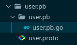

# Configuración GRPC
**Contenido**
- [Protocol Buffers](#protocol-buffers)
- [Servidor](#servidor)
- [Cliente](#cliente)

### Protocol Buffers
La estructura para poder llevar la información del cliente al servidor, es la siguiente llamada ```Usuario```

```proto
message Usuario {
    string name = 1;
    string location = 2;
    int64 age = 3;
    string infectedtype = 4;
    string state = 5;
}
```

Por otro lado, se encuentra dos estructuras que son las que trasmiten el mensaje de cliente a servidor (```userRequest```) y viceversa (```userResponse```)
- ```userRequest```

```proto
message userRequest {
    Usuario user = 1;
}
```

- ```userResponse```

```proto
message userResponse {
    string resultado = 1;
}
```

Por último se define el servicio rpc el cuál hace posible que se registre un nuevo usuario y de la posibilidad de que el servidor responda.

```proto
service userService {
    rpc regUser(userRequest) returns (userResponse) {};
}
```

Estas estructuras de mensajería y el servicio de rpc se definen en un mismo archivo ```user.proto```, seguido este archivo se compila con el comando 
```zsh
protoc user.proto --go_out=plugins=grpc:.
```

Al momento de compilar, se genera un archivo ```user.pb.go``` el cuál genera el compilador escrito en lenguaje Go que utiliza propiamente grpc para el servicio de mensajería.



_Árbol de archivos de Protocol Buffers_

Este mismo procedimiento se realizó tanto para el [cliente](#cliente) como para el [servidor](#servidor), los cuáles se detallan a continuación.

### Servidor
Primero se crea el módulo del servidor llamado ```grpccliente``` en go con el comando ```go mod init grpccliente```, seguido de eso se procede a definir los [Protocol Buffers](#protocol-buffers). 

Luego se crea el ```servidor.go``` de la siguiente manera:
